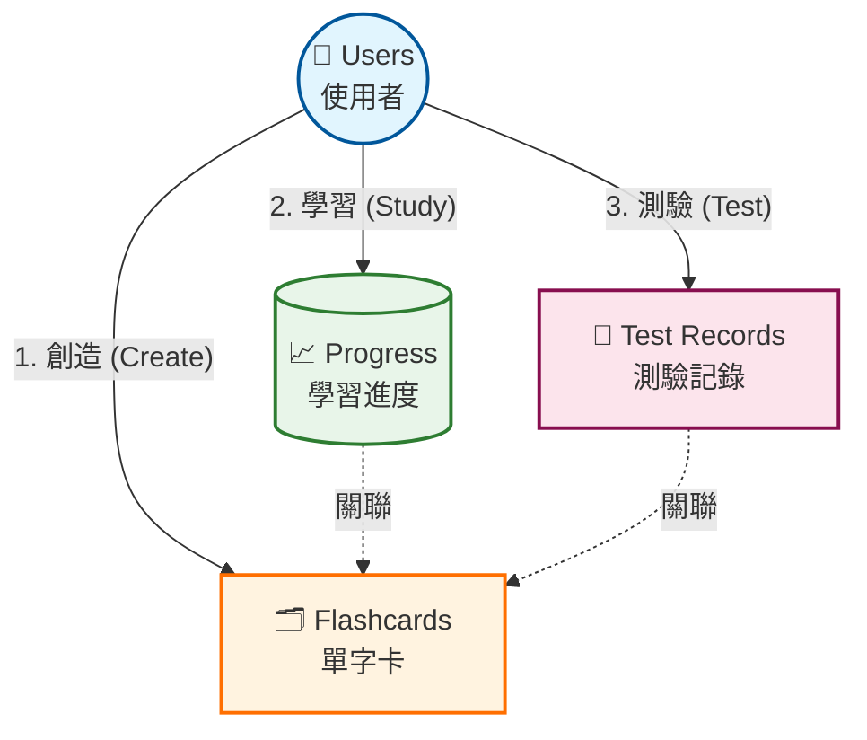

# 📚 VibeCoding 資料庫結構與資訊流指南

這份文件旨在協助開發者快速理解 VibeCoding Flashcard 的資料庫架構、核心關聯以及資料如何透過 API 在前端與後端之間流動。

---

## 🗺️ 系統全貌圖 (System Overview)

為了讓你更好理解，我們用「圖書館」來比喻整個系統：

*   **👥 Users (使用者)** = 圖書館的 **讀者**
*   **🗂️ Flashcards (單字卡)** = 圖書館裡的 **書籍**
*   **📈 User_Card_Progress (學習進度)** = 讀者的 **閱讀紀錄** (讀了幾次、熟不熟)
*   **📝 Test_Records (測驗記錄)** = 讀者的 **考試成績單**



---

## 🗃️ 核心資料表詳解 (Core Tables)

### 1. 👤 `users` (使用者 - 你的數位身分)
> 存放讀者的基本資料，像是等級、經驗值。

*   🔑 **ID**: 身分證字號 (UUID)
*   📛 **Username**: 名字
*   📧 **Email**: 電子信箱
*   ⭐ **Level/XP**: 當前等級與經驗值 (由學習活動累積)

### 2. 🗂️ `flashcards` (單字卡 - 知識的載體)
> 每一張卡片都是一個知識點。

*   🔑 **ID**: 卡片編號
*   🏷️ **Category**: 分類 (如: Backend, Frontend)
*   🔤 **English/Chinese**: 英文原文 / 中文翻譯
*   📝 **Description**: 詳細解釋 (核心知識)
*   💡 **Analogy**: 生活化比喻 (幫助記憶的神器)

### 3. 📈 `user_card_progress` (學習進度 - 你的大腦記憶庫)
> **這張表最重要！** 它記錄了「誰」對「哪張卡」有多熟。

```text
關聯結構： [👤 User] + [🗂️ Card] = [📈 Progress]
```

*   🧠 **Mastery Level (0-5)**: 熟悉度
    *   0: 😐 完全陌生
    *   1: 😗 剛開始學
    *   3: 🙂 漸入佳境
    *   5: 😎 滾瓜爛熟
*   🔄 **Times Reviewed**: 複習次數
*   ✅ **Times Correct**: 答對次數

### 4. 📝 `test_records` (測驗記錄 - 成長的軌跡)
> 每次測驗完，系統都會在這裡存一份「成績單」。

*   ⏱️ **Response Time**: 回答速度
*   🏆 **XP Earned**: 賺到的經驗值
*   📊 **Test Type**: 測驗類型 (翻牌、選題、拼寫)

---

## 🌊 資料流向與互動 (Data Flow & API)

這裡展示當你在網頁上操作時，資料是如何流動的。

### 🎬 場景一：建立新卡片 (Building a Card)

1.  **前端 (Frontend)**: 你填寫了「API」這張卡片的資料。
2.  **發送 (Request)**: `POST /flashcards`
    ```json
    { "term": "API", "user_id": "..." }
    ```
3.  **後端 (Backend/AI)**: 
    *   🤖 AI 幫你生成解釋與比喻。
    *   💾 資料庫寫入 `flashcards` 表。
    *   💾 同時在 `users` 表，你的 XP +5！
4.  **回應 (Response)**: 告訴你卡片建立成功，並回傳新卡片資料。

### 🎬 場景二：進行測驗 (Taking a Quiz)

1.  **前端**: 你回答了一題，答案正確！
2.  **發送**: `POST /test-records`
3.  **後端**:
    *   💾 **記錄成績**: 在 `test_records` 增加一筆「答對」記錄。
    *   📈 **更新進度**: 在 `user_card_progress` 把這張卡的熟悉度 +1。
    *   ⭐ **升級檢查**: 檢查 `users` 表的 XP 是否足夠升級。
4.  **回應**: 回傳「恭喜答對！XP +10，等級提升！」

---

## 🎨 視覺化符號對照表

| 符號 | 代表意義 | 對應程式碼概念 |
| :---: | :--- | :--- |
| 👤 | 使用者 /讀者 | `users` table |
| 🗂️ | 單字卡 / 知識 | `flashcards` table |
| 📈 | 進度 / 熟悉度 | `user_card_progress` table |
| 📝 | 記錄 / 成績單 | `test_records` table |
| 💾 | 儲存 / 寫入 | `INSERT` / `UPDATE` |
| 🤖 | AI 運算 | LLM Generation |
| ⭐ | 經驗值 / 獎勵 | `xp`, `level` |

---

### 💡 開發小貼士 (Dev Tips)

*   **多對多關係**: 一個 User 可以有很多 Cards，一張 Card 也可以被很多 User 學習 (如果是公開卡片)。但目前的架構偏向「私有卡片」，即 User 擁有自己的 Card。
*   **進度獨立**: 就算兩個人都有一張「API」的卡片，他們的 `progress` 是完全分開的。A 熟了，不代表 B 熟了。

希望這份指南能讓你對 VibeCoding 的資料庫一目了然！ 🚀
